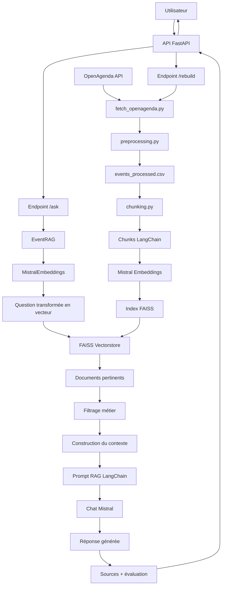

# Rapport Technique - Puls-Events RAG Chatbot

## 1. Présentation Du Projet

Puls-Events RAG Chatbot est un proof of concept de chatbot intelligent permettant de répondre à des questions sur des événements culturels en Occitanie à partir de données OpenAgenda / OpenDataSoft.

Le système utilise une architecture RAG, pour Retrieval-Augmented Generation. L'objectif est de ne pas laisser le modèle de langage répondre uniquement avec ses connaissances générales, mais de lui fournir d'abord des événements réellement présents dans une base locale.

Le chatbot peut répondre à des questions comme :

```text
Quels événements culturels sont prévus à Toulouse ?
Y a-t-il des concerts à Montpellier ?
Quels événements liés à la danse sont disponibles ?
```

Le système retourne :

- une réponse en langage naturel 
- les sources utilisées 
- une évaluation automatique légère de la réponse

## 2. Objectifs Métier

Le projet répond à plusieurs besoins métier :

- faciliter la recherche d'événements culturels 
- permettre une interrogation en langage naturel 
- recommander des événements pertinents selon une ville, un thème ou une période 
- réduire le risque d'hallucination en s'appuyant sur une base documentaire contrôlée 
- exposer les résultats via une API exploitable par un service externe

## 3. Architecture Générale Du Système

Le système est composé de plusieurs briques :

- une étape de collecte des données OpenAgenda 
- une étape de nettoyage et normalisation 
- une étape de transformation en documents 
- une étape de découpage en chunks 
- une étape de vectorisation avec Mistral Embeddings 
- une base vectorielle FAISS 
- une chaîne RAG avec LangChain 
- un modèle de génération Mistral 
- une API REST FastAPI

## 4. Schéma UML / Architecture



## 5. Description Des Composants

### 5.1 Collecte Des Données

Le fichier `scripts/fetch_openagenda.py` récupère les événements depuis l'API OpenAgenda / OpenDataSoft.

Le script utilise une pagination avec un offset pour récupérer plusieurs pages de résultats. Les événements récupérés sont sauvegardés sous deux formes :

- `data/raw/events_raw.json` : données brutes ;
- `data/processed/events_processed.csv` et `data/processed/events_processed.json` : données nettoyées.

La sauvegarde des données brutes permet de garder une trace de la source originale.

### 5.2 Nettoyage Et Préparation

Le fichier `src/preprocessing.py` nettoie et standardise les événements.

Les principales opérations sont :

- suppression des balises HTML 
- normalisation des espaces 
- extraction des champs utiles 
- suppression des événements sans identifiant 
- suppression des doublons 
- conversion des dates 
- suppression des événements sans titre ou sans date 
- conservation des événements récents et futurs

Chaque événement est aussi transformé en texte complet via le champ `text_for_embedding`. Ce texte sert ensuite à produire les embeddings.

### 5.3 Transformation En Documents Et Chunks

Le fichier `src/chunking.py` transforme les événements nettoyés en documents LangChain.

Chaque document contient :

- un contenu textuel 
- des métadonnées : titre, ville, date, lieu, URL, identifiant

Les documents sont ensuite découpés en chunks avec :

```text
chunk_size = 800
chunk_overlap = 120
```

Ce découpage permet d'améliorer la précision de la recherche sémantique.

### 5.4 Embeddings Mistral

Le fichier `src/mistral_embeddings.py` définit une classe compatible avec LangChain pour utiliser Mistral comme modèle d'embeddings.

Un embedding est une représentation numérique du sens d'un texte. Cela permet au système de comparer une question utilisateur avec les événements indexés, même si les mots utilisés ne sont pas exactement les mêmes.

Le modèle utilisé est :

```text
mistral-embed
```

Le code gère aussi les limites d'API avec un système de retry progressif en cas de rate limit.

### 5.5 Index Vectoriel FAISS

Le fichier `scripts/build_vectorstore.py` construit l'index FAISS.

FAISS stocke les vecteurs des chunks et permet de retrouver rapidement les documents les plus proches d'une question utilisateur.

Le choix de FAISS est pertinent pour ce projet car :

- il est rapide 
- il fonctionne localement 
- il est bien intégré à LangChain 
- il convient à un proof of concept RAG

### 5.6 Chaîne RAG

Le fichier `src/rag.py` contient le cœur du système.

La classe `EventRAG` :

- charge l'index FAISS 
- initialise les embeddings Mistral 
- initialise le modèle de chat Mistral 
- recherche les documents pertinents 
- construit le contexte 
- envoie le contexte au modèle 
- retourne la réponse et les sources

Le prompt demande explicitement au modèle de répondre uniquement à partir du contexte fourni et de ne jamais inventer d'événement.

### 5.7 API FastAPI

Le fichier `api/main.py` expose le système RAG via une API REST.

Les endpoints principaux sont :

| Endpoint | Méthode | Rôle |
| --- | --- | --- |
| `/health` | GET | Vérifie l'état de l'API et du RAG |
| `/ask` | POST | Pose une question au chatbot |
| `/rebuild` | POST | Reconstruit les données et l'index FAISS |

L'API utilise Pydantic pour valider les entrées et structurer les réponses.

## 6. Choix Techniques

### 6.1 Pourquoi Une Architecture RAG ?

Les événements changent régulièrement. Un modèle de langage seul ne peut pas connaître l'état exact et récent des événements OpenAgenda.

L'architecture RAG permet de :

- rechercher des informations dans une base documentaire contrôlée 
- fournir au modèle uniquement les documents pertinents 
- limiter les hallucinations 
- retourner les sources utilisées 
- mettre à jour la base sans réentraîner le modèle

### 6.2 Pourquoi Mistral ?

Mistral est utilisé pour deux tâches :

- la vectorisation des textes avec `mistral-embed` 
- la génération de réponse avec un modèle de chat Mistral

Ce choix permet de garder une chaîne cohérente et adaptée au français.

### 6.3 Pourquoi FAISS ?

FAISS est utilisé comme base vectorielle locale.

Il permet de faire une recherche par similarité sémantique, plus pertinente qu'une simple recherche par mots-clés.

Exemple : une question sur des spectacles musicaux peut retrouver des événements contenant les mots concert, jazz, festival ou musique, même si la formulation exacte est différente.

### 6.4 Pourquoi LangChain ?

LangChain simplifie l'orchestration du système RAG :

- documents 
- embeddings 
- vectorstore 
- prompt 
- modèle de langage 
- chaîne de génération

Cela rend le code plus structuré et plus facile à faire évoluer.

### 6.5 Pourquoi FastAPI ?

FastAPI permet de créer rapidement une API REST claire, typée et automatiquement documentée avec Swagger.

C'est un bon choix pour exposer le système à un futur service externe ou à une interface utilisateur.

## 7. Adaptation Aux Spécificités Métier

Le projet contient plusieurs adaptations métier :

- les événements sont filtrés pour garder un corpus récent et les événements à venir 
- les métadonnées importantes sont conservées : titre, ville, date, lieu, URL 
- le prompt est spécialisé sur les événements culturels en Occitanie 
- les questions concernant le futur déclenchent un filtre sur les événements passés 
- les réponses retournent les sources utilisées

Le système détecte notamment des mots comme :

```text
prévu, prévus, à venir, prochain, demain, week-end
```

Quand ces mots sont présents, seuls les événements futurs sont conservés dans les résultats.

## 8. Évaluation Du Système

Le projet contient un jeu de test annoté :

```text
data/evaluation/test_questions.csv
```

Ce fichier contient :

- des questions de test 
- des réponses attendues 
- une ville attendue 
- un mot-clé attendu 
- une indication sur la nécessité d'événements futurs

Le script `scripts/evaluate_rag.py` permet d'évaluer les réponses générées.

Les indicateurs utilisés sont :

- exact match 
- similarité TF-IDF 
- similarité cosinus 
- règles métier 
- métriques DeepEval si disponibles

Le fichier `src/evaluation.py` ajoute aussi une évaluation automatique légère directement dans la réponse API.

## 9. Tests

Le projet contient plusieurs tests unitaires et fonctionnels dans le dossier `tests/`.

Les tests couvrent notamment :

- le preprocessing 
- le chunking 
- la récupération OpenAgenda 
- la structure des embeddings 
- la création et le chargement FAISS 
- l'API FastAPI 
- les fonctions d'évaluation

Les tests peuvent être lancés avec :

```bash
pytest
```

Avec couverture :

```bash
pytest --cov=src --cov=api
```

## 10. Déploiement Local

Le projet contient un `Dockerfile` et un `docker-compose.yml`.

Le service `vectorstore-builder` :

- récupère les données 
- nettoie les événements 
- construit l'index FAISS

Le service `api` :

- lance l'application FastAPI 
- expose l'API sur le port 8000

Commande de lancement :

```bash
docker compose up --build
```

## 11. Exemples D'utilisation

### Vérifier l'état de l'API

```bash
curl http://127.0.0.1:8000/health
```

### Poser une question

```bash
curl -X POST http://127.0.0.1:8000/ask \
  -H "Content-Type: application/json" \
  -d "{\"question\":\"Quels événements culturels sont prévus à Toulouse ?\"}"
```

### Reconstruire L'index

```bash
curl -X POST http://127.0.0.1:8000/rebuild \
  -H "X-API-Key: your_rebuild_secret"
```

## 12. Limites Identifiées

Le système fonctionne, mais certaines limites existent :

- la détection des questions futures repose sur des mots-clés 
- le filtrage par ville n'est pas encore strict avant la recherche vectorielle 
- il n'y a pas encore de reranking avancé 
- l'index FAISS est local 
- la fraîcheur des données dépend de la dernière reconstruction 
- les performances dépendent de la qualité des données OpenAgenda 
- il n'y a pas encore d'interface utilisateur graphique

## 13. Améliorations Possibles

Les améliorations possibles sont :

- ajouter un endpoint `/metadata` 
- extraire automatiquement la ville, la date et le type d'événement depuis la question 
- ajouter un filtrage strict par métadonnées 
- ajouter un reranker après FAISS 
- mieux gérer les expressions temporelles comme ce soir, samedi ou la semaine prochaine 
- automatiser la reconstruction régulière de l'index 
- ajouter une interface web 
- ajouter du monitoring et des logs structurés 
- améliorer l'évaluation automatique 

## 14. Conclusion

Ce projet met en place une chaîne RAG complète, depuis la collecte de données jusqu'à l'exposition des réponses via une API REST.

La solution répond aux principaux besoins :

- collecte et nettoyage des données 
- création d'une base vectorielle 
- recherche sémantique 
- génération augmentée par contexte 
- retour des sources 
- API exploitable 
- tests et évaluation

Le système constitue une base solide pour un chatbot métier autour des événements culturels. Les prochaines étapes consisteraient principalement à renforcer le filtrage métier, ajouter un endpoint `/metadata`, améliorer les métriques d'évaluation et préparer un déploiement plus complet.